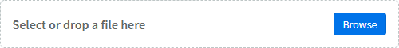
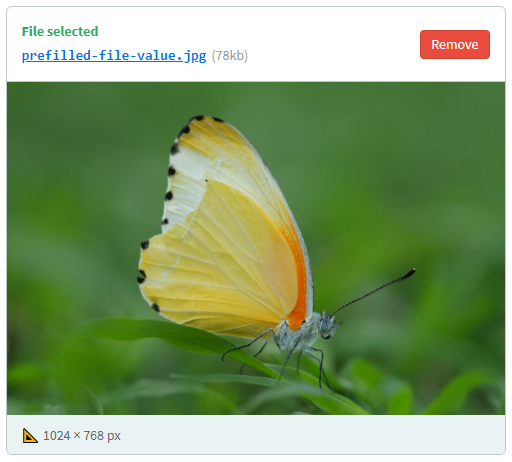

# 💚 Upload Buddy


**Upload Buddy is a lightweight JavaScript library that makes it easy to integrate smart, interactive file uploads into any form.**

Here's what we have to offer:

- 😊 User-friendly UI with browse and drag & drop support.
- ☁ Lightweight: pure JavaScript, no extra dependencies.
- 🔎 Inline image preview + crop tool integration.
- 📄 Easy to integrate & supports showing pre-filled file values.

## Preview

<p align="center">



↓



</p>

## Installation
This library is available as a package on npm: `upload-buddy`.

To use Upload Buddy, include `upbud.min.js` on your page. We also recommend including our default stylesheet (`default.css`), unless you are planning on providing your own styles.

```html
<script src="upload-buddy/dist/upbud.min.js"></script>
<link rel="stylesheet" href="upload-buddy/dist/default.css"/>
```

## Configuration
You must provide your own `<input type="file"/>` field on the page. Upload Buddy will wrap that field and replace it with a friendly interface. To do so, simply call `UbField.setup()` with a query selector and any custom options:

```javascript
UbField.setup('#the-file', {
  // Define upload target:
  target: "/my_upload_endpoint",

  // Set a built-in language (en, nl):
  lang: "nl",

  // Individual text overrides / translations:
  text: {
    "drop_file": "🔥 Drop it like it's hot 🔥"
  },

  // To show pre-filled file on the UI:
  file: {
    name: "prefilled-file-value.jpg",
    size: 79000,
    url: "https://live.staticflickr.com/4561/38054606355_26429c884f_b.jpg",
    type: "image/png",
    custom: "metadata"
  }
});
```

*Note: You can set the global default configuration for `UbField` by modifying the value of `UbFieldConfig.defaults`.*

## Integration

### Events

#### `ub-ready`
This event is emitted on the document when the script has loaded. This may be useful if you are loading the script with async/defer.

### Upload step

If the input renders without a pre-filled `file` object in the configuration, or once "Delete" is clicked on a previously selected file, the field will instead appear empty:


The user can either drag and drop a file onto the control, or click it anywhere to manually select a file.

### Ajax upload

When a file is selected by any means, a `POST` HTTP request will be sent to the configured `target` URL. The request will contain `FormData`, with the actual file data under the `file` key.

- **Your endpoint should respond with a `200 OK` if the upload was successful.** 
    - You can include a JSON object in the response body. We'll use the `url` property from the object if you provide it, to determine the final URL of the file. Any other data is passed back to you when the form is submitted (useful for communicating things like an upload ID).  
    
- **Any non-200 status code is seen as an error.**
    - You may optionally include a plain-text error message in the response body that will be shown to the user.
    
## Extras
    
### Cropper.js
    
Integration with [Cropper.js](https://github.com/fengyuanchen/cropperjs) is supported. Simply include the library before activating Upload Buddy, and when an image is selected, a "Crop" button will appear (we will test if `window.Cropper` is defined).

Once the image has been cropped, it will be re-uploaded automatically, and the field's value will be updated accordingly.
