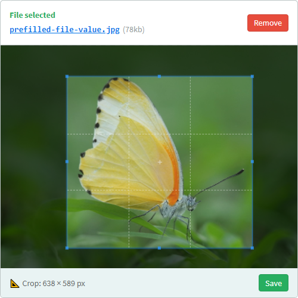

# 💚 Upload Buddy
**Upload Buddy is a lightweight JavaScript library that makes it easy to integrate smart, interactive file uploads into any application, without any extra dependencies.**

## Setup
This package is available for installation via npm as `release-buddy`:

```shell script
yarn install release-buddy
```

Alternatively, you can self-host by grabbing the files you need from the `dist` folder in the latest build.

Simply include `upbud.min.js` from `dist` on any page you want to use the library. If you want to use the default CSS styles, you'll also need to include `default.css`:

```html
<script src="upload-buddy/dist/upbud.min.js"></script>
<link rel="stylesheet" href="upload-buddy/dist/default.css"/>
```

**Once included, you can make use of the various components in this library, detailed in the sections below.**

## `UbField`

### Features
UbField is a user-friendly, drop-in replacement for your existing `file` upload field in any HTML form. It offers the following features:

- 😊 User-friendly UI with drag & drop support
- 🚀 Direct server upload via Ajax
- 🔎 Useful extensions for supported file types (e.g. preview, image cropping, etc)
- 📄 Form integration: display previously file value, receive new file metadata. 



You can use our default stylesheet, or adapt it to make your own.

### Configuration
Simply pass in a document query for the `file` input you wish to replace, plus any options:

```javascript
UbField.setup('#the-file', {
  // Define upload target:
  target: "/my_upload_endpoint",

  // Set a built-in language (en, nl):
  lang: "nl",

  // Individual text overrides / translations:
  text: {
    "drop_file": "🔥 Drop it like it's hot 🔥"
  },

  // To show pre-filled file on the UI:
  file: {
    name: "sample.png",
    size: 1024,
    url: "/uploads/sample.png",
    type: "image/png"
  }
});
```

Note: You can set the global default configuration for `UbField` by modifying the value of `UbFieldConfig.defaults`.

### Uploads

#### Client request
Whenever the user selects a file in the UI - either by dropping it on the field or by browsing to it - uploading begins.

On upload, a `POST` HTTP request will be sent to the configured `target` URL. The request will contain form data, with the file data under the `file` key. 

#### Server response

Your ajax upload endpoint should respond as follows for proper integration:

- **On success:** Your endpoint should respond with a `200 OK` if the upload was successful. 

    - If your response body contains a JSON object, that object will be passed back via the HTML form (see *Form integration* below). This can be useful for passing along file metadata, like an upload ID, back to the server on form submit.

- **On failure:** Your endpoint should return any non-200 status code. You may optionally include a plain-text error message in the response body that will be shown to the user.

### Form integration
Once you replace a `file` input with a `UbField`, the flow of your form will change as follows:

- Uploads are now asynchronously completed as soon as the file is selected by the user, rather than your server receiving the file along with the form submit.

- You will not receive your `file` input via the form; instead of a file, a simple text value will be sent under the replaced field's name.

    - If no file is selected, or an existing file was removed in the UI, the field's POST value will be blank (an empty string). 
    
    - If a file is selected, you will receive a JSON object with file metadata as the field's POST value. This is a combination of data provided by the user, plus any data returned by your upload endpoint. For example:
    
        ```json
        {}
        ```